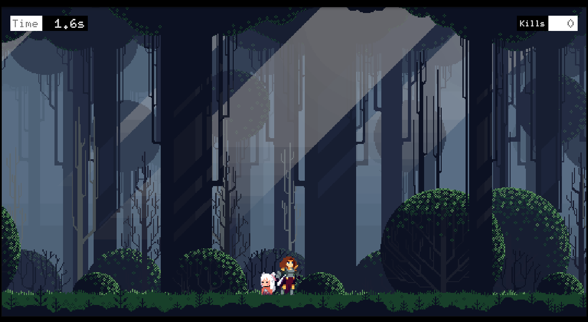
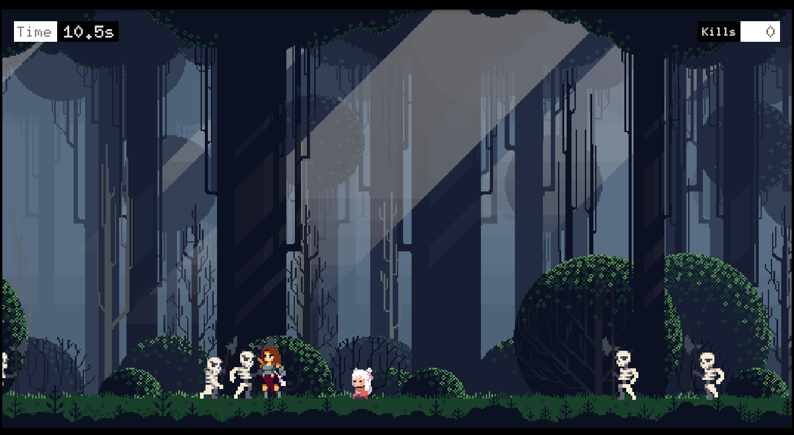
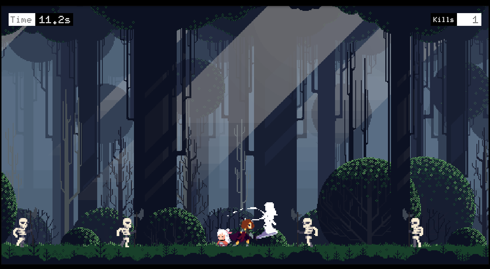
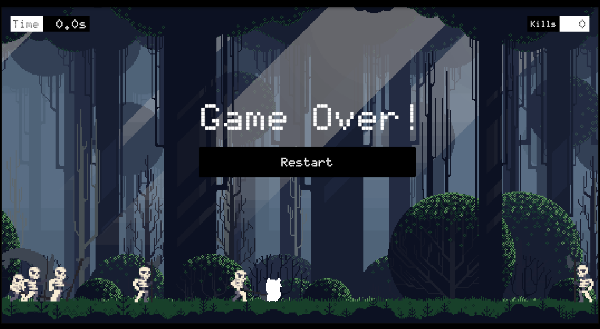

# Save The Princess

[▶️ Play Save The Princess on Unity Play](https://play.unity.com/en/games/5fa3b2bc-5640-49e7-9324-08991b441d96/index)

## 🎮 Overview

**Save The Princess** is a 2D action platformer built in Unity. Battle enemies, overcome obstacles, and rescue the princess! The game features smooth movement, responsive controls, and dynamic enemy respawning for a challenging experience.

---

## 📷 Screenshots

|  |  |
|---|---|
|  |  |


---

## 🚀 Features

- **Player Movement & Jumping**: Responsive controls for running and jumping.
- **Combat System**: Attack enemies using mouse or keyboard.
- **Enemy Logic**: Enemies detect and attack the player, with respawn logic and dynamic difficulty.
- **Princess Character**: The princess reacts to the player and triggers game over on defeat.
- **Damage Feedback**: Visual feedback when entities take damage.
- **UI**: Real-time timer, kill count, and game over screen.
- **Level Restart**: Instantly restart the level from the UI.

---

## 🗂️ Project Structure

```
Assets/
  Animations/         # Animation controllers and assets
  InputSystems/       # Input action assets
  Material/           # Materials for feedback and physics
  Prefab/             # Prefabs for enemies and other entities
  Scenes/             # Unity scenes
  Scripts/            # C# scripts for gameplay logic
  Settings/           # Rendering and volume profiles
  Sprites/            # Game graphics
  TextMesh Pro/       # Text assets
Packages/             # Unity package manifest
ProjectSettings/      # Unity project settings
```

---

## 🕹️ Controls

- **Move**: Arrow keys / A & D
- **Jump**: Spacebar
- **Attack**: Left Mouse Button or 'V'
- **Restart Level**: Click 'Restart' on Game Over UI

---

## 📦 Key Scripts

- `Player.cs`: Handles player movement, jumping, and attacking.
- `Enemy.cs`: Enemy AI, movement, and attack logic.
- `Entity.cs`: Base class for all entities (player, enemy, princess).
- `Enemy_Respawner.cs`: Spawns enemies at random points with decreasing cooldown.
- `Princess.cs`: Princess behavior and game over trigger.
- `UI.cs`: Manages UI elements, timer, kill count, and game over screen.
- `EntityAnimationEvents.cs`: Animation event hooks for attacks and movement.

---

## 🖼️ Art & Assets

- **Sprites**: Custom graphics for player, enemies, backgrounds, and UI.
- **Materials**: Visual feedback for damage and physics interactions.
- **Animations**: Smooth transitions for movement and attacks.

---

## 🛠️ Getting Started

1. **Clone the repository**
   ```zsh
   git clone https://github.com/BKarthik7/SaveThePrincess.git
   ```
2. **Open in Unity**
   - Use Unity Hub to open the project folder.
   - Recommended Unity version: _2022.3 LTS_ or later.
3. **Play the Game**
   - Open `SampleScene.unity` in the `Scenes` folder.
   - Click Play!

---

## 📝 Contributing

Pull requests are welcome! For major changes, please open an issue first to discuss what you would like to change.

---

## 🙏 Credits

### Special thanks to [AlexDev YouTube Channel](https://www.youtube.com/@unityalexdev) for inspiration and tutorials.

---
